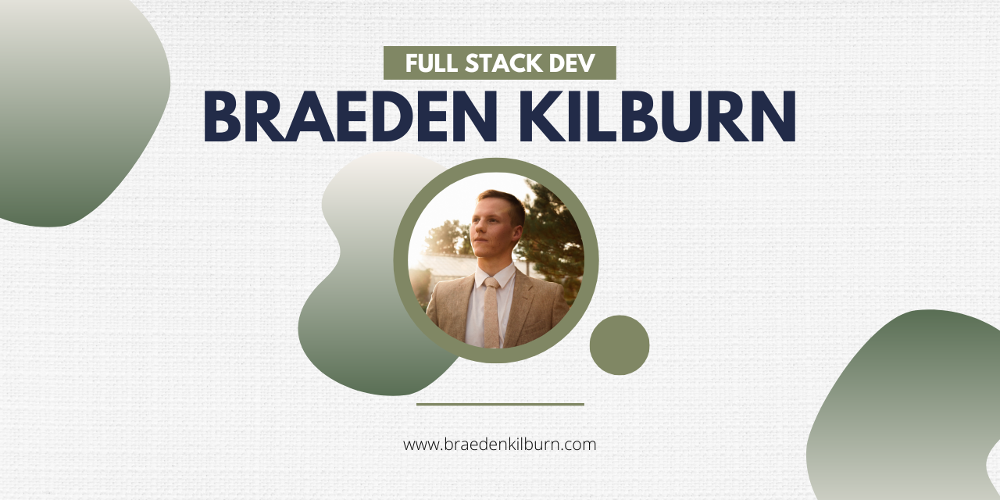

Hey there 👋

I’m Braeden, a front-end developer, SWE at Vivint, and an aviation enthusiast. I enjoy designing and developing websites or applications with a human-centered focus to give my user the best experience possible.

Want to know more about me? [Check out my portfolio.](https://braedenkilburn.com/)
